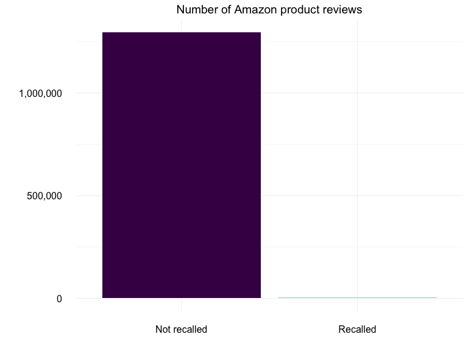
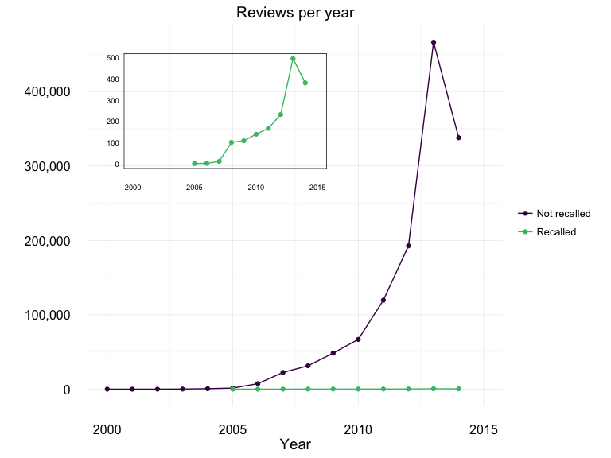
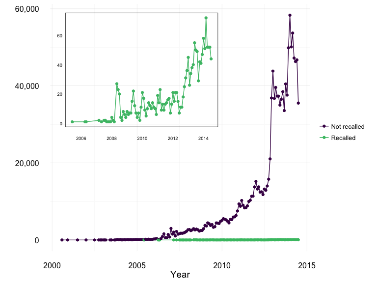
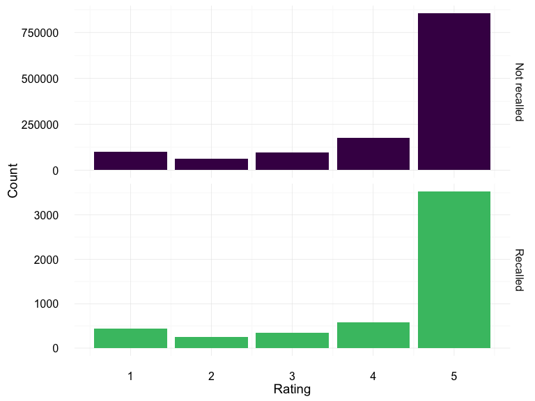
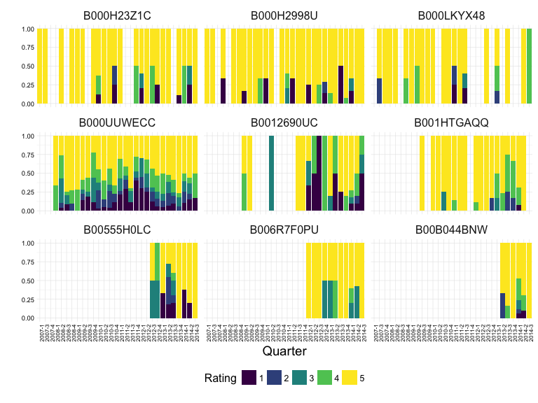

Exploration of Amazon Review Data
================
Kara Woo
July 8, 2016

Load packages and data
----------------------

First, load the required packages

``` r
library("jsonlite")
library("dplyr")
library("tidyr")
library("ggplot2")
library("scales")
library("lubridate")
library("viridis")
```

Then, load the Amazon review data and list of recalled UPCs/ASINs.

``` r
## Load Amazon review data
json_file <- "../data/raw/reviews_Grocery_and_Gourmet_Food.json"
amz <- stream_in(file(json_file))

## Load list of recalled products
recalled <- read.csv("../github_data/asin_intersection_full.csv",
                     stringsAsFactors = FALSE)

recalled <- mutate(recalled, initiation_date = as.Date(initiation_date))

## Extract vector of ASINs of recalled products
recalled_asins <- unique(recalled$asin)

## Add column to indicate whether product was recalled. Also create a proper
## date column in YYYY-MM-DD, and a year column.
amz_clean <- amz %>%
  mutate(recall = ifelse(asin %in% recalled_asins, "Recalled",
                         "Not recalled"),
         date = as.Date(reviewTime, format = "%m %j, %Y"),
         year = year(date))
```

This is a custom ggplot2 theme for all of the plots:

``` r
mytheme <- theme_set(theme_minimal())
mytheme <- theme_update(
  strip.text = element_text(size = 12),
  axis.text = element_text(size = 12),
  axis.title = element_text(size = 14)
)
```

Review counts of recalled vs. non-recalled products
---------------------------------------------------

There are a total of 5149 reviews for recalled food products and 1292007 reviews for non-recalled food products.

``` r
ggplot(amz_clean, aes(x = recall, fill = recall)) +
  geom_bar() +
  scale_y_continuous(labels = comma) +
  scale_fill_viridis(discrete = TRUE, end = 0.7) +
  labs(y = "",
       x = "",
       title = "Number of Amazon product reviews") +
  theme(legend.position = "none")
```



### Reviews per year of recalled vs. non-recalled products

``` r
yearly_tally <- amz_clean %>%
  group_by(year, recall) %>%
  tally()

## Reviews over time for recalled and non-recalled food products
fullplot <- ggplot(yearly_tally, aes(x = year, y = n, color = recall)) +
  geom_line() +
  geom_point() +
  scale_color_viridis(discrete = TRUE, end = 0.7) +
  scale_y_continuous(labels = comma) +
  scale_x_continuous(limits = c(2000, 2015)) +
  labs(x = "Year",
       y = "",
       color = "",
       title = "Reviews per year")

## Recalled products only
recallplot <- ggplot(yearly_tally[yearly_tally$recall == "Recalled", ],
                     aes(x = year, y = n)) +
  geom_line(color = "#49be74") +
  geom_point(color = "#49be74") +
  scale_x_continuous(limits = c(2000, 2015)) +
  labs(x = "Year",
       y = "") +
  theme(axis.title.x = element_blank(),
        axis.text.x = element_text(size = 7, margin = margin(0, -10, 0, 0, "pt")),
        axis.text.y = element_text(size = 7, margin = margin(0, -10, 0, 0, "pt")),
        panel.grid = element_blank(),
        panel.border = element_rect(color = "black", fill = NA))

g = ggplotGrob(recallplot)
fullplot + annotation_custom(grob = g, xmin = 1999, xmax = 2009, ymin = 260000,
                             ymax = 460000)
```



### Reviews per month of recalled vs. non-recalled products

``` r
monthly_tally <- amz_clean %>%
  mutate(month = month(date),
         newdate = as.Date(paste(year, month, "01", sep = "-"), "%Y-%m-%d")) %>%
  group_by(newdate, recall) %>%
  tally()

fullplot_mo <- ggplot(monthly_tally, aes(x = newdate, y = n, color = recall)) +
  geom_line() +
  geom_point() +
  scale_color_viridis(discrete = TRUE, end = 0.7) +
  scale_y_continuous(labels = comma) +
  labs(x = "Year",
       y = "",
       color = "")

## Recalled only
recallplot_mo <- ggplot(monthly_tally[monthly_tally$recall == "Recalled", ],
                        aes(x = newdate, y = n)) +
  geom_line(color = "#49be74") +
  geom_point(color = "#49be74") +
  labs(x = "Year",
       y = "") +
  theme(axis.title.x = element_blank(),
        axis.text.x = element_text(size = 7, margin = margin(0, -10, 0, 0, "pt")),
        axis.text.y = element_text(size = 7, margin = margin(0, -10, 0, 0, "pt")),
        panel.grid = element_blank(),
        panel.border = element_rect(color = "black", fill = NA))

g_mo = ggplotGrob(recallplot_mo)
fullplot_mo + annotation_custom(grob = g_mo,
                                xmin = as.numeric(as.Date("1999-06-01")),
                                xmax = as.numeric(as.Date("2010-01-01")),
                                ymin = 25000, ymax = 60000)
```



Rating distribution for recalled and non-recalled products
----------------------------------------------------------

``` r
ggplot(amz_clean, aes(x = overall, fill = recall)) +
  geom_bar() +
  facet_grid(recall ~ ., scales = "free_y") +
  scale_fill_viridis(discrete = TRUE, end = 0.7) +
  labs(y = "Count",
       x = "Rating") +
  theme(legend.position = "none")
```



Ratings over time for recalled products
---------------------------------------

View the rating distribution over time for the 9 recalled products that have the most reviews.

First find the recalled products with the most reviews

``` r
asins_ordered <- amz_clean %>%
  filter(recall == "Recalled") %>%
  group_by(asin) %>%
  tally() %>%
  arrange(desc(n))

top_asins <- asins_ordered[1:9, ]$asin  # Choose top 9
```

Subset review data to only include these product. Then find the quarterly count of each star rating (1-5) for each product.

``` r
top_asins_ratings  <- amz_clean %>%
  filter(asin %in% top_asins) %>%
  mutate(quarter = quarter(date),
         overall = as.character(overall)) %>%
  group_by(year, quarter, asin, overall) %>%
  tally() %>%
  mutate(newdate = paste(year, quarter, sep = "-")) %>%
  left_join(recalled, by = "asin")
```

Visualize quarterly rating distribution for the 9 most reviewed recalled products.

``` r
ggplot(top_asins_ratings, aes(x = newdate, y = n, fill = overall)) +
  geom_bar(position = "fill", stat = "identity") +
  facet_wrap(~ asin, scales = "free_x") +
  scale_fill_viridis(discrete = TRUE) +
  theme(axis.text.x = element_text(size = 6, angle = 90, margin = margin(t = -12)),
        axis.text.y = element_text(size = 7, margin = margin(r = -12)),
        legend.position = "bottom") +
  labs(x = "Quarter",
       y = "",
       fill = "Rating")
```


